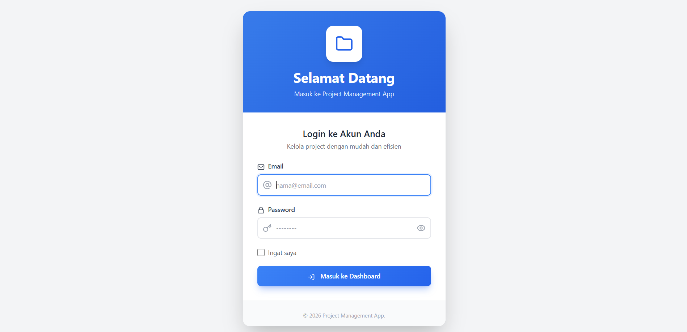
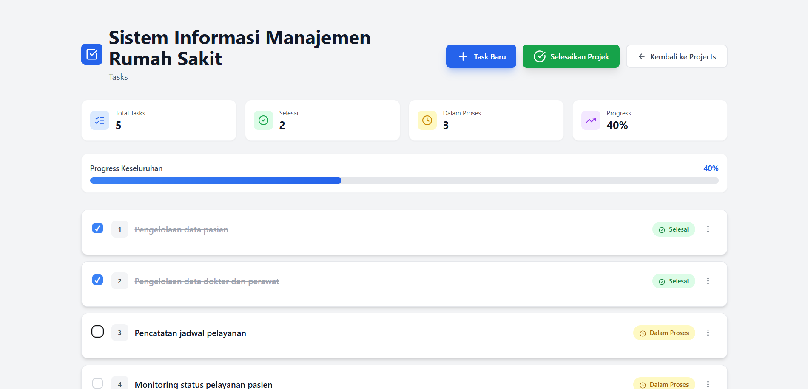
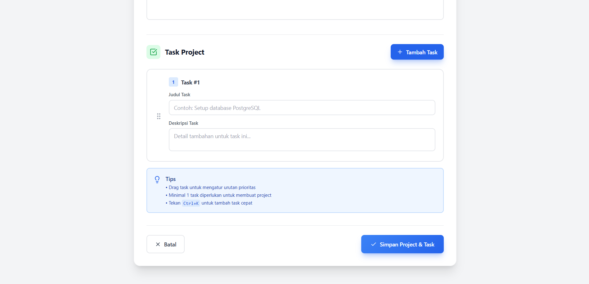

# Project Management App

Aplikasi manajemen project berbasis **NestJS** dengan sistem autentikasi sederhana dan fitur pengelolaan project serta task. Aplikasi ini dirancang untuk membantu pengguna mengatur project, memecahnya menjadi beberapa task, serta memantau progres penyelesaiannya.

---

## Cara Run

### 1. Install dependancy
```bash
npm install
```
Atau menggunakan yarn:
```bash
yarn install
```

### 2. Buat file .env di directory root, kemudian isi dengan ini:
```bash
# App
APP_PORT=..... # (Default: 3000)

# Session
SESSION_SECRET=..... # (Random)
SESSION_MAX_AGE=..... # (Lama session, bebas)
```

### 3. Seed data user (admin)
```bash
npx ts-node src/seed/seed.ts
```

### 4. Jalankan aplikasi
#### Mode Development
```bash
npm run start:dev
```
#### Mode Production
```bash
npm run build
npm run start:prod
```

### 5. Akses aplikasi
```bash
http://localhost:PORT
```

### 6. Akses dokumentasi endpoint
```bash
http://localhost:PORT/api/docs
```

---

## Fitur Utama

### 1. Autentikasi Pengguna
- Login menggunakan email dan password
- Validasi kredensial pengguna dengan enkripsi password (bcrypt)
- Manajemen sesi berbasis session (Express Session)
- Logout untuk mengakhiri sesi pengguna
- Proteksi halaman login agar tidak dapat diakses oleh user yang sudah login

### 2. Manajemen Project
- Menampilkan daftar seluruh project
- Menampilkan jumlah project yang telah selesai
- Membuat project baru dengan:
  - Nama project
  - Deskripsi project
  - Minimal satu task
- Validasi input project (nama wajib, panjang maksimal, dan unik)
- Mengedit data project (nama dan deskripsi)
- Menghapus project
- Menandai project sebagai selesai (completed)
- Project yang sudah selesai tidak dapat dimodifikasi

### 3. Manajemen Task
- Menampilkan daftar task berdasarkan project
- Menambahkan satu atau lebih task ke dalam project
- Mengedit task (judul dan deskripsi)
- Menghapus task
- Menandai task sebagai selesai atau belum selesai
- Status task terintegrasi dengan status project
- Task tidak dapat diubah jika project sudah selesai

### 4. Status & Progres Project
- Mengambil status project berdasarkan progres task
- Informasi status project tersedia melalui endpoint khusus
- Digunakan untuk monitoring progres project secara keseluruhan

### 5. Validasi & Error Handling
- Validasi ID project dan task
- Penanganan error untuk data tidak ditemukan
- Pesan error yang informatif pada form
- Fallback aman saat terjadi kesalahan server

### 6. Server-Side Rendering
- Menggunakan template engine untuk render halaman
- Halaman yang tersedia:
  - Login
  - Daftar project
  - Form create & edit project
  - Daftar task per project
  - Form create & edit task

---

## Teknologi yang Digunakan
### Backend
- **Node.js** (disarankan ≥ v18)
- **NestJS** `^11.x`
- **TypeScript** `^5.7`
- **Express**

### Database & ORM
- **TypeORM** `^0.3.x`
- **SQLite** `^5.x`

### Authentication & Session
- **express-session** `^1.19`
- **bcrypt** `^6.0` (password hashing)
- **connect-sqlite3** `^0.9` (session store)

### View & UI
- **EJS** `^4.0`
- **express-ejs-layouts** `^2.5`
- **Tailwind CSS** `^4.1`

---

## Tujuan Pengembangan
Aplikasi ini dibuat sebagai:
- Media pembelajaran backend dengan NestJS
- Implementasi konsep MVC dan service-based architecture
- Latihan pengelolaan relasi data (Project & Task)
- Simulasi aplikasi manajemen project sederhana

---

## Desain Database

Aplikasi ini menggunakan database relasional dengan **TypeORM**. Desain database terdiri dari tiga entitas utama: **User**, **Project**, dan **Task**, yang saling berelasi untuk mendukung fitur manajemen project dan task.

### 1. User

Entitas **User** menyimpan data akun pengguna yang dapat mengakses aplikasi.

**Tabel:** `users`

| Kolom     | Tipe Data | Keterangan |
|----------|----------|------------|
| id       | number   | Primary key (auto increment) |
| email    | string   | Email pengguna (unik) |
| password | string   | Password pengguna (hashed) |
| isActive | boolean  | Status aktif akun |

Catatan:
- Email bersifat unik untuk mencegah duplikasi akun.
- `isActive` digunakan untuk menonaktifkan akun tanpa menghapus data.

---

### 2. Project

Entitas **Project** merepresentasikan sebuah project yang berisi kumpulan task.

**Tabel:** `projects`

| Kolom        | Tipe Data | Keterangan |
|-------------|----------|------------|
| id          | number   | Primary key |
| name        | string   | Nama project |
| description | text     | Deskripsi project (opsional) |
| isCompleted | boolean  | Status penyelesaian project |

Relasi:
- Satu **Project** dapat memiliki banyak **Task** (One-to-Many).

---

### 3. Task

Entitas **Task** menyimpan detail pekerjaan yang berada di dalam sebuah project.

**Tabel:** `tasks`

| Kolom        | Tipe Data | Keterangan |
|-------------|----------|------------|
| id          | number   | Primary key |
| title       | string   | Judul task |
| description | text     | Deskripsi task (opsional) |
| isCompleted | boolean  | Status task |
| projectId  | number   | Foreign key ke tabel `projects` |

Relasi:
- Setiap **Task** hanya dimiliki oleh satu **Project** (Many-to-One).
- Menggunakan **CASCADE DELETE**, sehingga jika project dihapus, seluruh task terkait akan ikut terhapus.

---

## Screenshot Aplikasi

### 1. Halaman Login


### 2. Halaman Daftar Project


### 3. Halaman Detail Project (beserta Task)


### 4. Halaman Tambah Project


### 5. Halaman Tambah Task


